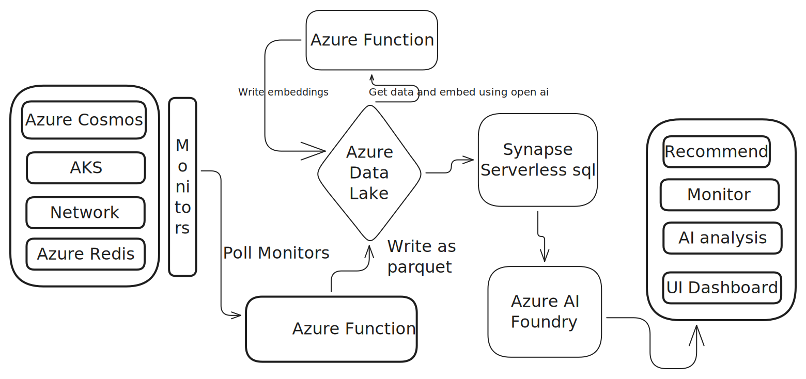

# Design Doc for Azure SRE AI Agent

The Azure SRE AI Agent is designed to analyze resource metrics, starting with 8 key resources and 8 critical metrics. This innovative solution empowers developers to quickly identify anomalies in production Azure resources, offering actionable insights. Unlike traditional dashboards, this AI-driven approach adds an intelligent layer on top of raw metrics, enhancing developer productivity, optimizing resource utilization, and driving cost efficiency for cloud infrastructure. By leveraging AI, the agent transforms data into meaningful recommendations, enabling smarter decision-making and improved operational excellence.

| Resource               | Metric 1                  | Metric 2                  | Metric 3         | Metric 4                 | Metric 5          | Metric 6          | Metric 7              | Metric 8              |
|------------------------|---------------------------|---------------------------|------------------|--------------------------|-------------------|-------------------|-----------------------|-----------------------|
| VMs                    | CPU Utilization (%)       | Memory Utilization (%)    | Disk IOPS        | Network Bytes In/Out     | Availability (%)  | Idle Time (%)     | Power State (on/off)  | Failure Rate (errors) |
| AKS                    | Node CPU (%)             | Node Memory (%)           | Pod Count        | Node Count               | Disk Usage (%)    | Network Bytes     | API Requests          | Pod Failures          |
| Cosmos DB              | Normalized RU (%)        | Total Requests            | Data Usage (GB)  | Index Usage (GB)         | Request Latency (ms) | Availability (%) | Failure Rates         | Throttled Requests    |
| Storage Account        | Total Egress (GB)        | Total Ingress (GB)        | Transaction Count| Availability (%)         | Latency (ms)      | Error Rate        | Storage Used (GB)     | Throughput (ops/s)    |
| Redis Cache            | Cache Hit Ratio (%)      | Cache Miss Ratio (%)      | Memory Usage (%) | Connections              | Commands Processed| Evicted Keys      | Latency (ms)          | Errors                |
| VNet & Load Balancer   | Bytes Sent/Received      | Packet Count              | Connection Count | SNAT Ports Used          | Health Probe Status | Latency (ms)     | Dropped Packets       | Availability (%)      |
| Application Insights   | Incoming Requests        | Request Duration (ms)     | Failed Requests  | Dependency Calls         | Dependency Duration | Exceptions       | Page Views            | Performance Counters  |
| Network Watcher        | Traffic Volume (bytes)   | Flow Logs Count           | Packet Drops     | Connection Attempts      | Latency (ms)      | Error Rate        | Bandwidth Usage       | DDoS Attacks          |

## Functional Requirements

1. The AI agent monitors resource utilization, security threats, reliability, and performance, providing real-time insights.
2. The agent analyzes metrics every 10 minutes, offering insights and correlating them with hourly, daily, weekly, and monthly patterns to deliver a comprehensive overview of each resource.
3. The agent evaluates cross-resource metrics to provide a broader perspective, aiding in issue detection and resolution.
4. The agent must be cost-effective, operating within the same subscription at a cost of $100–$200 per application.
5. It provides resource optimization recommendations based on trends, performance, and resource configurations.
6. An admin UI is available for simplified resource tagging, allowing administrators to select resource groups and resources where the agent should operate.
7. An Admin/Developer Dashboard offers resource visualization, recommendations, optimizations, and AI-driven insights. It supports zoom functionality to display granular insights (per hour/minute) or aggregated insights (daily/weekly) based on the zoom level.

## Technical Requirments

1. The AI agent provides a secure, in-house, cost effective that provide ROI for the enterprise applications
2. Use managed identity to ensure security
3. AI agent resources should be in a seperate resource groups to avoid confusion
4. Scalability & performace
5. Monitoring and alerts to resource owners on anaomolies
6. Provide smart suggestions rather a boring metrics

## Architecture

The Azure cloud optimizations is a in-house solution run within the boundries of the Entra application. The major steps include collecting the metrics from resources, get config and store the minute-minute metrics for every 10 mins for each resource, have a configurations recommendations and advisories from azure. Create embeddings and vectorization for the data and feed the data to Ai agent as a knowledge.source and provide dashboards/UI. Admin should be able to add the resources and get estimation of the solution cost as well having access to dashboards

Step by step 

1. Admin UI for resource selection
    UI hosted in Azure which is integrated with Entra for the admins to select the resources from the resource group and provide estimated cost for the in-house running
    Identity enabled - more secure

2. Metrics Configs and Azure recommendations/advisor
    Azure monitor for per minute metrics/logs
    Azure resource graph for configs
    Azure recommendations/advisory

3. Ingestion of metrics/config - ETL & Batching
    Azure function that triggers every 10 minutes (configurable by admin), pulls metrics for all resources
    Write parquet to Azure data lake (batching saves cost)

4. Storage and Partitioning (Azure data lake)
    Azure data lake gen2 for hierarchial partitioning
    Store parquets - RG/date/resource (metrics/vms/App1-RG/2025/09/28/batch_1400.parquet)
    /metrics/{resourceType}/{resourceId}/{year}/{month}/{day}/{hour}/batch_{ts}.parquet

5. Vectorization for RAG (Azure function + Azure open AI)
    Function app to call openAI and text embeddings
    Create/append vector column write to data-lake (embedding) -- is it written to same parquet?? No
    OpenAI embeddings enable semantic RAG - create contexual insights
    Embed summaries or anomalous windows only. Option: embed one summary per resource per batch (not one per metric). That cuts embedding & LLM costs by 10 ??
    embeddings/.../batch.parquet??
    /embeddings/{resourceType}/{resourceId}/{year}/{month}/{day}/embeddings_{batch}.parquet??
    FAISS in a long-running service (recommended)
    Keep a small FAISS server (AKS/Container Apps) that you update every batch (append incremental index). Fast, low latency, cost-effective. Avoid rebuilding index per request.

6. Retrieval for Insights (Azure Synape Sql + FAISS)
    Synapse for structured queries - FAISS in azure function for vector search
    Queries batches for sementically search??
    Provide granular zoom - FAISS for vector search

7. AI Agent for processing
    Phi-3 is a low cost - SLM - retreive batchs insights/ recommendations and previous recommendations/insights
    Generate insights based on data - correlate cross resources

8. Output & dashboard
    UI with azure app, powerbi for visual embedding
    UI with dashboards with zoom in zoom out that provide insights for hourly daily monthly 
    Justification of why these recommendationss

Reliabiity

    Idempotency: write batches with deterministic batch_id. Retries must not produce duplicates.

    DLQ / poison queue for failed embedding tasks.

Security & Compliance
    Use Managed Identities everywhere.

    Use private endpoints for ADLS, Synapse, Event Hub.

    Key Vault for any secrets and rotate regularly.

    PII scrubbing before embedding (hash or remove user ids, emails, etc.).

    RBAC scoping so admins only see RGs they’re allowed to.

